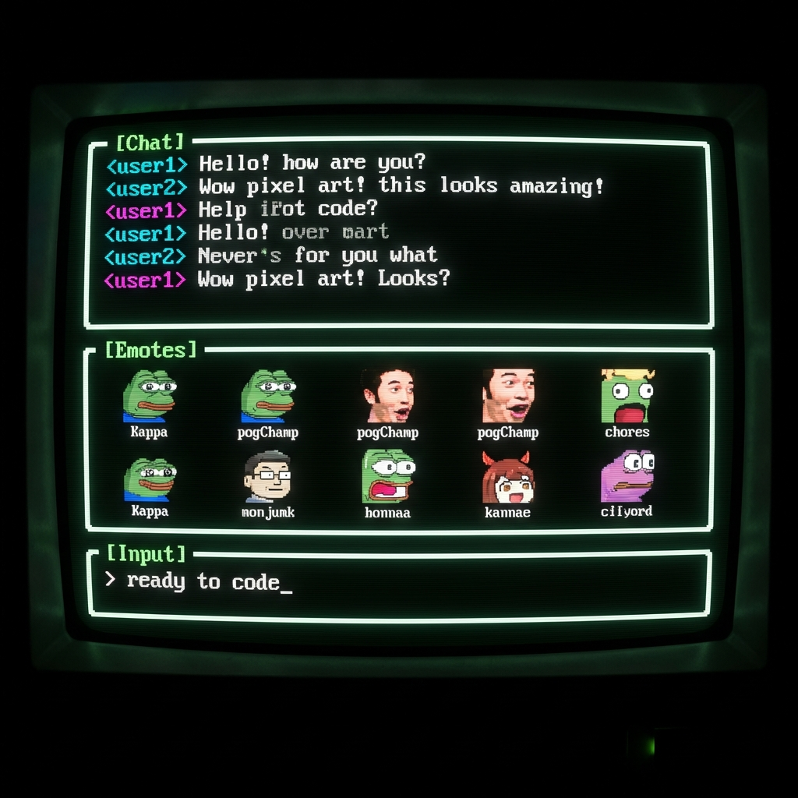

# Choui - The No-GUI Chatbot

I started streaming on Twitch and wanted a chatbot from the terminal to avoid CPU overhead from Chrome, other browsers too. So, I made this.

I made this for me but others can use it too.

**Choui** (pronounced *Chewy*) the-NOT-gui is a high-performance, fully terminal-based Twitch Chatbot written in Rust.

Built with **Ratatui** (TUI), Tokio-tungstenite (WebSocket client), and Serde (JSON serialization), Choui-the-NOT-gui is designed to be fast, efficient, and customizable.

First thing I ever vibecoded. Google Antigravity ftw. Made this in like a couple hours.
